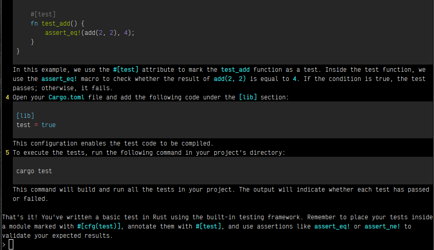

# OpenAI CLI Chat

To use this program, this folder should be your current directory.

    cd chat

Install dependencies:

    python3 -m pip install -r requirements

Replace in the config file your OpenAI's API key.

To run the app:

    ./chat.py

Or:

    python3 chat.py
